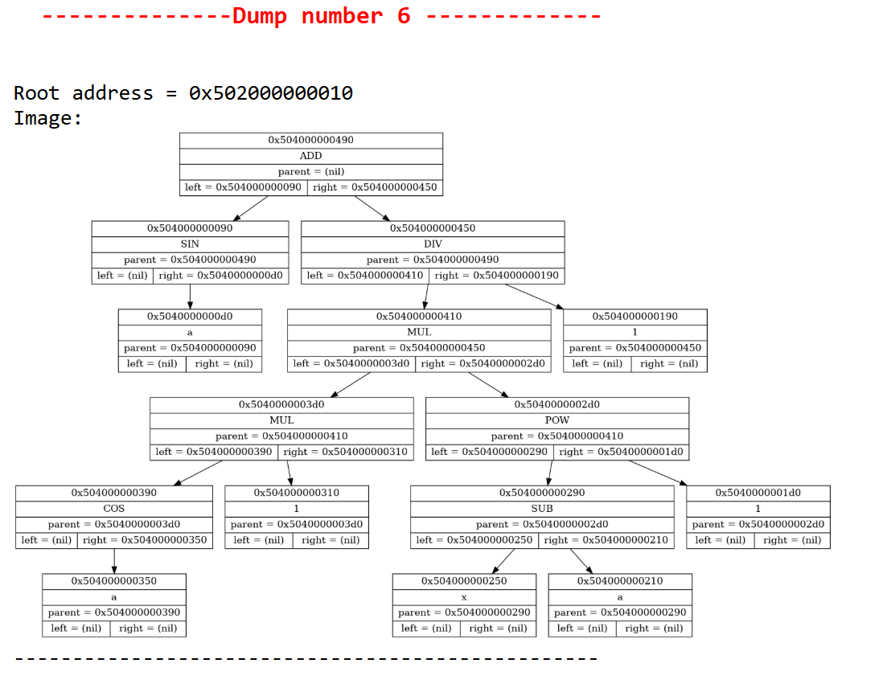

# Дифферинциатор

Проект представляет собой программу для дифференцирования математических выражений и разложения их в ряд Тейлора. Реализовано упрощение выражения, графический дамп и вывод промежуточных этапов упрощения в LaTex - документ. Результат выводится в виде TEX- и PDF-файлов.

## Реализация
### Грамматика

Математическое выражение, находящееся во входном файле должно быть написано согласно данной грамматике:

```bnf
<gen> ::= <expr> "$"
<expr> ::= <term> (("+" | "-") <term>)*
<term> ::= <pow> (("*" | "/") <pow>)*
<pow> ::= <parenth> ("^" <parenth>)*
<parenth> ::= "(" <expr> ")" | <num> | <func> | <var>

<func> ::= ["sin" | "cos" | "tan" | "cot" | "ln"] "(" ")"
<var> ::= [a-z A-Z] {a-z A-Z 0-9 _}*
<num> ::= {0-9}+

```

## Функционал

### 1. Дифференцирование
- Выражение считывается из текстового файла
- Программа строит синтаксическое дерево методом рекурсивного спуска.
- Упрощает дерево, обходя его, пока не закончатся возможности для упрощения
- Обходит дерево и создаёт новое, которое в математичемском смысле является производной от данного. После этого производится еще одно упрощение
- Все шаги записываются в tex- и html-файлы, в последнем добавлена визуализация этапов с помощью Graphviz.

### 2. Разложение в ряд Тейлора
- Пользователь выбирает степень разложения.
- Программа строит синтаксическое дерево методом рекурсивного спуска.
- Упрощает тривиальные констуркции (свёртка констант, умножение на 0 и т.д.)
- Для каждого порядка разложения находит n-ую производную и вычисляет соответствующий моном для произвольной точки а, который добавляется к итоговому полиному.
- Всё вышеперечисленное записывается в tex- и html-файлы с визуализацией с помощью GraphViz.

#### Ключевые функции для работы с деревом
- **Считывание из файла**: Реализовано рекурсивным спуском, возвращет дерево, построенное по данному выражению

- **Дифференцирование**: меняет исходное дерево на его производную. Для читабельности кода используется локальный DSL, основанный на макросах

- **Вывод**: Одна функция строит визуализацию дерева и выводит ее в html-файл, а другая записывает выражение в tex-файл. Во втором случае учитывается приоритет операций, поэтому лишние скобки не выводятся, что сильно упрощает читаемость

- **Упрощение**: Убираются тривиальные конструкции для уменьшения размера дерева и итоговой формулы. Обрабатываются следующие случаи:
    - Свёртка констант
    - Умножение на 0 и 1 слева и справа
    - Сложение и вычитание с 0 слева и справа
    - Деление 0 на другой операнд
    - Возведение в 0 и 1 степень

- **Графический дамп**: Пример визуализации дерева с помощью Graphviz
    